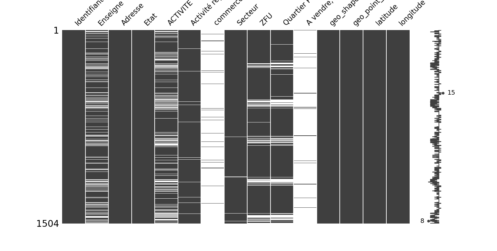

# Python Missingno

Missingno is an open-source Python library that generates Missing data visualization.

[](http://forthebadge.com) [](http://forthebadge.com)  [](http://forthebadge.com)  [](http://forthebadge.com)

## Getting started

1. Install missingno with pip

```bat
pip install missingno
```

2. Clone this project
3. Execute Missingno.py


### Screenshots



## Build with

* [Python](https://www.python.org/) - Programming language
* [Git](https://git-scm.com) - Open source distributed version control system
* [Roubaix Open Data Portal](https://opendata.roubaix.fr/pages/accueil/)

## Useful links or documents

* [Missingno](https://pypi.org/project/missingno/) - Missing data visualization module for Python.
* [Missingno Repository](https://github.com/ResidentMario/missingno) - Thanks to [Aleksey Bilogur](https://github.com/ResidentMario)

## Contributing

If you would like to contribute, read the CONTRIBUTING.md file to learn how to do so.
